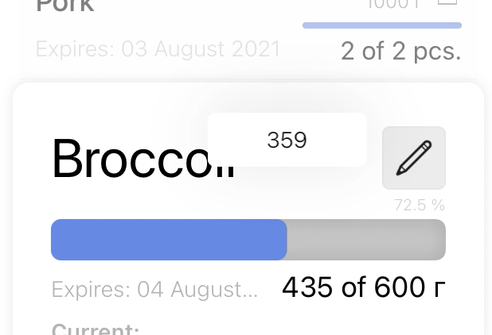

# Pointless slider

[](https://github.com/Carthage/Carthage)



Кастомный слайдер с анимацией и поповером. 

## Установка

### Carthage

[Carthage](https://github.com/Carthage/Carthage) - это децентрализованный менеджер зависимостей, который строит ваши зависимости. Чтобы интегрировать Pointless slider в ваш проект, укажите в `Cartfile`:

```ogdl
github "cheliuskin-galich/PointlessSlider" ~> 1.0
```

После этого в папке с проектом выполните команду:

```
carthage update --use-xcframeworks
```

